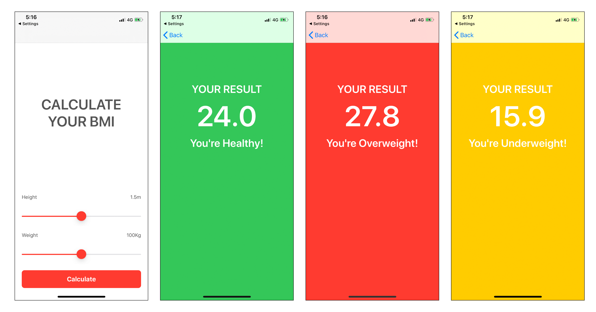

# BMI-Calculator-ProgrammaticUI
BMI-Calculator-ProgrammaticUI

Welcome to the BMI-Calculator-Programmatic wiki!

Body Mass Index formula to calculate:

Body Mass Index is a simple calculation using a person’s height and weight.
The formula is BMI = kg/m2 where kg is a person’s weight in kilograms and m2 is their height in metres squared.
A BMI of 25.0 or more is overweight, while the healthy range is 18.5 to 24.9. BMI applies to most adults 18-65 years.

Measurement Units	Formula and Calculation
Kilograms and meters (or centimeters)	
Formula: weight (kg) / [height (m)]2

My Formula Declaration in Xcode: (BCCalculation.swift)

func calculateBMI(height: Float, weight: Float) {
        
        BMIvalue = weight / pow(height, 2)    
}

The formula for BMI is weight in kilograms divided by height in meters squared. If height has been measured in centimeters, divide by 100 to convert this to meters.

Pounds and inches	
Formula: 703 x weight (lbs) / [height (in)]2

When using English measurements, pounds should be divided by inches squared. This should then be multiplied by 703 to convert from lbs/inches2 to kg/m2.

Here's the Chart of the BMI according to the standard guidelines and study.

[Here's the link to learn more about BMI guidelines](https://www.runsociety.com/bmi-calculator/)

here are the screenshots of app:

